# Brushstrokes

Welcome to Brushstrokes, your gateway to a vibrant online art gallery showcasing the talent of Glasgow's local artists. This platform serves as both an art blog and a digital exhibition space, providing a canvas for creativity to flourish. Whether you're an art enthusiast, collector, or simply curious about the diverse artistic expressions emerging from Glasgow, Brushstrokes invites you to explore, connect, and celebrate the rich tapestry of local artistry.


## Table of Contents
1. [Existing Features](#existing-features)
   1. [Navigation Bar](#navigation-bar)
   2. [Home Page](#home-page)
   3. [About Section](#about-section)
   4. [Contact](#contact)
   5. [Gallery](#gallery)
   6. [Artwork Detail](#artwork-detail)
   7. [Login](#login)
   8. [Sign Up](#sign-up)
   9. [Logout](#logout)
   10. [Account](#account)
   11. [Save to Collection](#save-to-collection)
   12. [Commenting](#commenting)
   13. [Footer](#footer)

2. [Features Left to Implement](#features-left-to-implement)
   1. [Location Map](#location-map)
   2. [Artwork Purchase Functionality](#artwork-purchase-functionality)

3. [Testing](#testing)
   1. [Manual Testing](#manual-testing)
   2. [Automated Testing](#automated-testing)
      - [Validator Testing](#validator-testing)

4. [Models](#models)
   1. [Artwork Model](#artwork-model)
   2. [Comment Model](#comment-model)
   3. [Contact Form Submission Model](#contact-form-submission-model)

5. [UX Design](#ux-design)
   1. [Wireframes](#wireframes)
   2. [Flow Diagram](#flow-diagram)

6. [Fixed Bugs](#fixed-bugs)

7. [Deployment](#deployment)

8. [Credits](#credits)
   1. [Content](#content)
   2. [Media](#media)


## Exisiting Features
### Navigation Bar
- **Visitor View:** On all pages, visitors are presented with a clean navigation bar displaying options for "Home," "About," "Gallery," "Contact," and "Login/Signup." "Login" and "Signup" options guide new visitors to access the platform's features.
- **Logged-In User View:** Upon logging in, the navigation bar dynamically updates to reflect personalised options such as "Account," and "Logout." Users can seamlessly transition between various sections and manage their account settings effortlessly.
- **Responsive Design:** The navigation bar adapts for smaller screens, offering an intuitive dropdown menu for an enhanced and user-friendly experience on mobile devices.

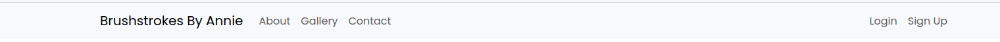

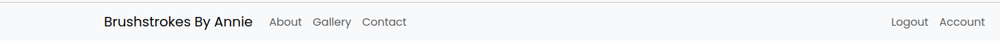


### Home Page 

The heart of our platform, the landing page, is a visual symphony that welcomes users with a vibrant and bold background image featuring an array of paintbrushes. This imagery not only sets the artistic tone but also aligns seamlessly with the essence of our online art gallery and blog.

- **Background Image:** A captivating display of paintbrushes takes center stage, creating an immersive and visually engaging atmosphere.
- **Welcome Message:** A warm and inviting welcome message greets users, encouraging them to become a part of our creative community. This friendly invitation sets the tone for a welcoming online space.
- **Text Overlay Animation:** The text overlay dynamically slides in from the left, adding a touch of animation to capture users' attention. This subtle yet eye-catching movement enhances the overall user experience.
- **Call to Action:** Positioned prominently below the welcome message is a clear and inviting button. This button serves as a gateway, prompting users to easily explore our main attraction—the gallery. Its strategic placement ensures users can seamlessly embark on a journey through the captivating artworks featured on the site.

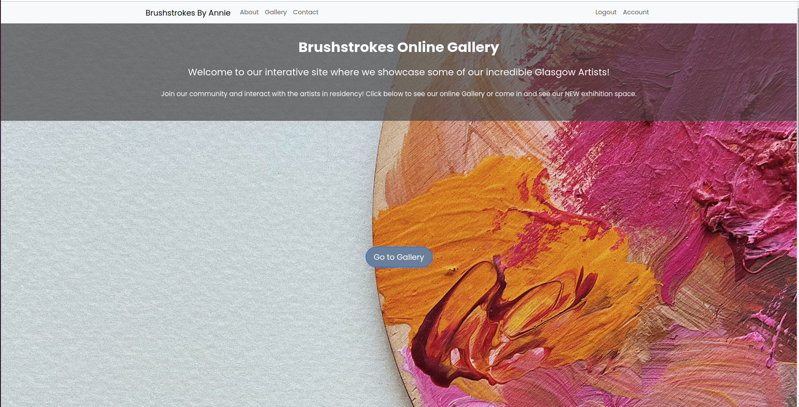


### About Section

The About section serves as a narrative journey through the evolution of our platform, beginning as a humble art blog and blossoming into a dynamic online gallery. Rooted in simplicity and visual allure, the design draws users into our story.

- **Humble Origins:** The narrative unfolds with a brief introduction, detailing the origins of our platform as a humble art blog. It narrates the initial spark that ignited our creative journey.
- **Online Gallery Development:** Evolving organically, the platform transitioned into a robust online gallery, showcasing the incredible talent within Glasgow's art community. This transformation laid the foundation for a vibrant digital space.
- **Design Approach:** The design of this section is intentionally simple yet eye-catching, ensuring that the user's focus remains on the narrative. Clean lines, subtle animations, and a harmonious color palette contribute to the visual appeal.
- **Call to Action:** A clear and inviting button beckons users to "Join the Community," providing seamless access to the sign-up page. This strategic placement facilitates user engagement and community building.
- **Scrolling Prompt:** Encouraging users to explore further, a gentle prompt invites them to continue scrolling. This intuitive design feature ensures a fluid and immersive storytelling experience.
  
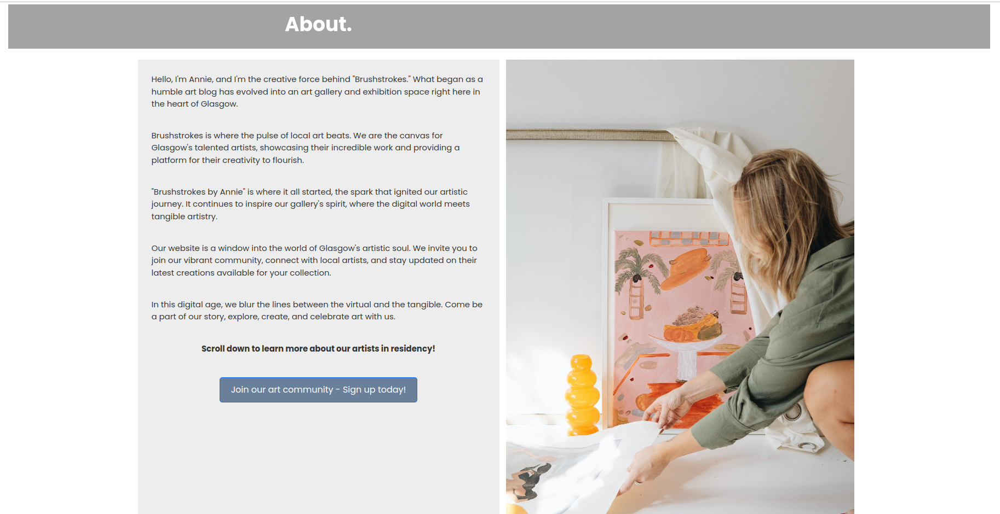

As users scroll, they encounter a curated showcase introducing the Artists in Residency. Each artist is presented with a brief description of their unique style, offering a glimpse into the diverse tapestry of our online gallery.

- **Introduction to Artists:** Brief narratives unveil the artistic personas in our online gallery, creating a personal connection between users and the talent behind the showcased artworks.
- **Styles of Painting:** The descriptions provide insights into each artist's distinctive style, setting the stage for an exploration of the diverse and captivating artworks available in our online gallery.

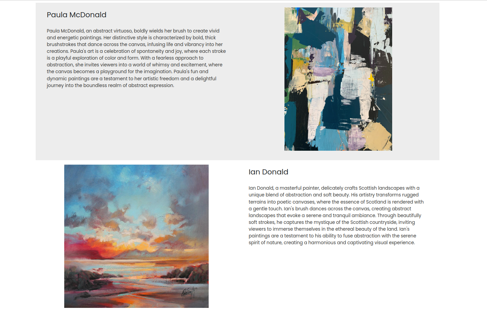


### Contact

The Contact section is designed with simplicity and user-friendliness in mind, providing an effortless way for users to connect with us. The overall design prioritizes an intuitive and pleasant user experience, making it easy for individuals to reach out and engage with our platform.

- **Simplicity:** A clean and uncluttered design minimizes distractions, keeping the focus on the communication process.
- **Accessibility:** The form's straightforward layout ensures accessibility for users of all levels of technical proficiency.
- **Form Fields:** The form prompts users to enter their name, email, and message, facilitating a straightforward communication process.
- **Validation:** A user-friendly feature ensures that the form cannot be submitted if any of the fields are left blank, encouraging complete and accurate submissions.
- **Email Validation:** Additionally, the form checks for a valid email format, ensuring that users provide a correctly formatted email address.

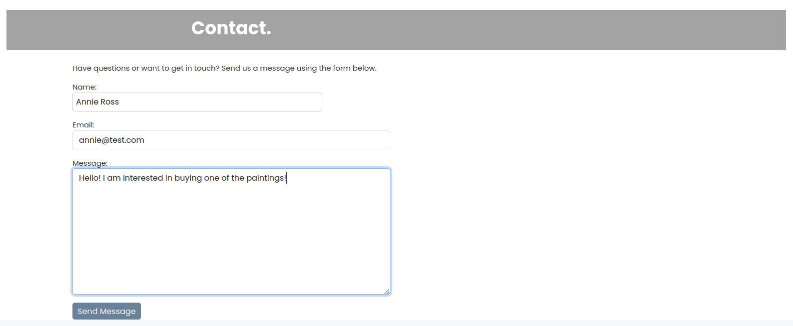

Upon successfully submitting the form, users are greeted with a warm and friendly confirmation message.

- **Confirmation Message:**"Thanks for your email! We will get back to you as soon as we can." This appreciative and reassuring message acknowledges the user's outreach and sets expectations for a timely response.

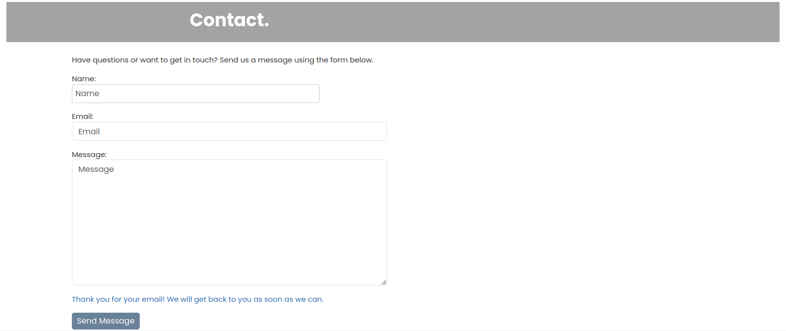


### Gallery

The Gallery section is the centerpiece of our platform, meticulously organized to showcase the artwork in our gallery and highlight the talents of our local artists in residency.

- **Ordering:** Artworks are displayed in chronological order based on their publication date, providing a chronological journey through our evolving gallery.
- **Grid Layout:** The gallery adopts a grid layout, with artists presented in rows of four for a visually pleasing and organized display.
- **Artwork Presentation:**

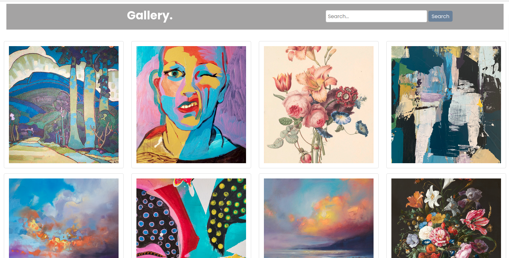

Enhancing the user experience, a subtle hover effect is implemented on the artwork thumbnails.

- **Title Display:** When hovering over an artwork, the title gracefully appears, adding an informative touch without cluttering the visual space.
- **Dimming Effect:** The artwork subtly dims upon hover, creating a stylish and eye-catching presentation.

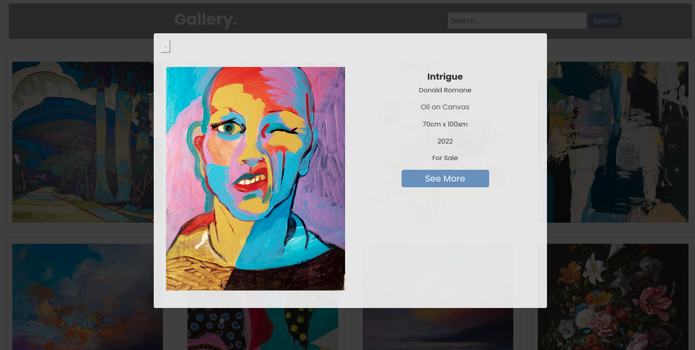

Clicking on an artwork thumbnail triggers a modal display, offering an immersive view of the artwork along with detailed information.

- **Content**: The modal includes essential details such as title, artist, medium, size, and availability status (sold or not).
- **Stylish Design:** The modal design incorporates a stylish layout, with a slightly dimmed background to draw attention to the artwork.
- **Navigation:** An exit button allows users to close the modal, while a "See More" button provides a seamless transition to a dedicated page with a comprehensive description of the artwork.

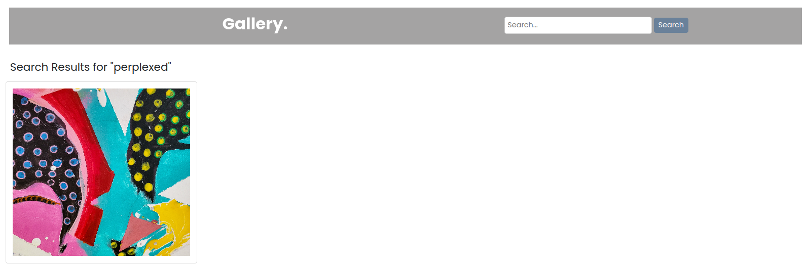

A powerful search bar at the top of the gallery screen enables users to easily find their favorite artworks.

- **Search Options:** Users can search by artist name, artwork title, or medium, providing flexibility and convenience.

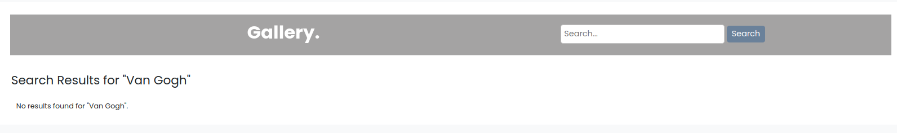

- **Search Results:** If no search results are found, a clear message appears, stating "No results found," ensuring users are informed.


### Artwork Detail

The Artwork Detail page offers users an immersive experience, providing a comprehensive description of the artwork they've chosen to explore further.

- **Entrance Animation:** The page features an animated image that gracefully enters from the left, adding a touch of dynamism to captivate the user's attention.
- **Full Description:** The page showcases a complete and detailed description of the artwork, including its origin, inspiration, and any other relevant information.
- **Save to Collection Button:** For users who are logged in, a special feature enhances their interaction with the artwork. A "Save to Collection" button appears at the bottom of the description, allowing logged-in users to curate their own collection of favorite artworks.
- **Back to Gallery Link:** At the top of the page, a "Back to Gallery" link provides an easy way for users to return to the gallery and continue exploring.
- **User-Friendly Layout:** The layout is designed to be user-friendly, with a clear flow of information and intuitive navigation elements

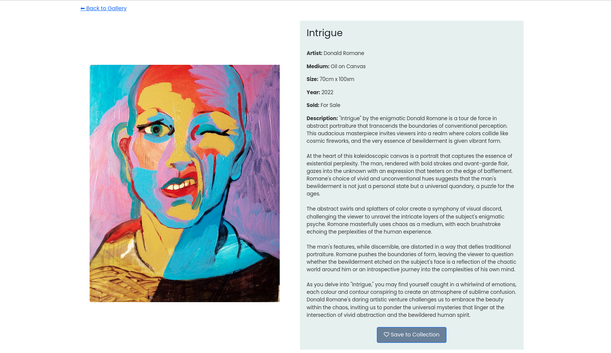

### Login

The Login page is designed to provide a straightforward and user-friendly experience for users to access their accounts.

- **Minimalistic Design:** The page adopts a minimalistic design, focusing on simplicity and ease of use.
- **Fields:** The login form allows users to enter their credentials and gain access to their accounts. Users are prompted to enter their username/email and password.
- **Remember Me:** A "Remember Me" checkbox allows users to opt for persistent login sessions for convenience.
- **Sign Up Link:** A link in the description encourages users who don't have an account to sign up. This link directs them to the Sign-Up page for a seamless transition.

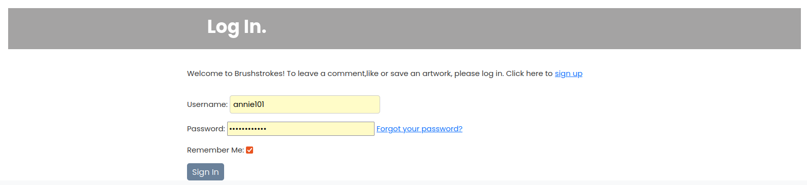


### Sign Up

The Sign-Up page is crafted with a user-centric design, aiming for simplicity and ease of use.

- **Minimalistic Design:** Like the login page, the Sign-Up page adopts a minimalistic design for a clean and straightforward user experience.
- **Fields:** Users are asked to enter their email, name, and a password (entered twice for confirmation).
- **Remember Me:** A "Remember Me" checkbox allows users to opt for persistent login sessions for convenience.
- **Sign In Link:** A link is provided for users who already have an account and need to sign in, directing them to the Login page.
- **Password Reset:** For users who forget their password, a link is available to initiate the password reset process. This ensures a secure and user-friendly way to regain access to their accounts.
- **Error Handling:** Clear error messages are displayed if there are issues with the provided information, guiding users to correct any errors and successfully complete the signup.


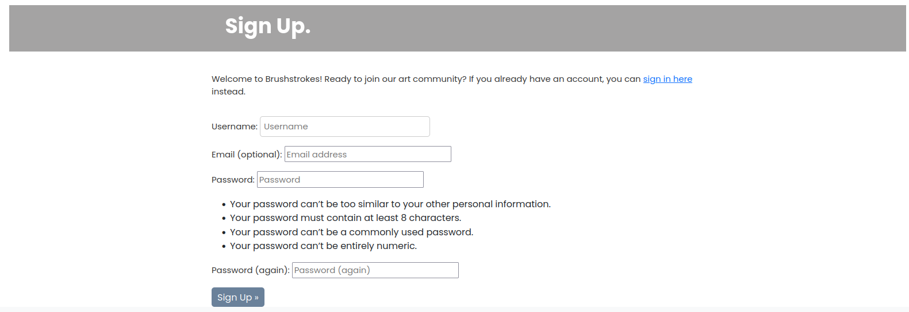


### Logout

The Logout page is a key component of ensuring a secure and user-friendly experience for users who wish to end their session.

- **Conditionally Viewable:** The Logout section is only visible if the user is currently logged in, ensuring that it is accessible to those who need it.
- **Message Prompt:** Upon navigating to the Logout page, a message is displayed, warmly addressing the user by their personal username. The message asks if they would like to log out, providing a personal and friendly touch.
- **Redirect to Homepage:** After confirming the logout, the user is seamlessly redirected to the homepage, offering a smooth transition out of their session.


### Account

The Account page is a personalized space for logged-in users, providing access to user-specific information and features.

- **Personalised Information:** At the top of the page, the user's personal username and email are clearly displayed, creating a personalised and welcoming experience.
- **Artwork Collection:** Below the user information, there is a dedicated section displaying artworks that the user has saved to their collection.
- **Artwork Thumbnails:** Each saved artwork is represented by a thumbnail image for easy identification.
- **Clickable Artworks:** Users can click on the artwork thumbnails to be redirected to the detailed view of the artwork in the Artwork Detail page.
- **Remove from Collection:** Each saved artwork includes an option to remove it from the collection. This provides users with control over their saved items.

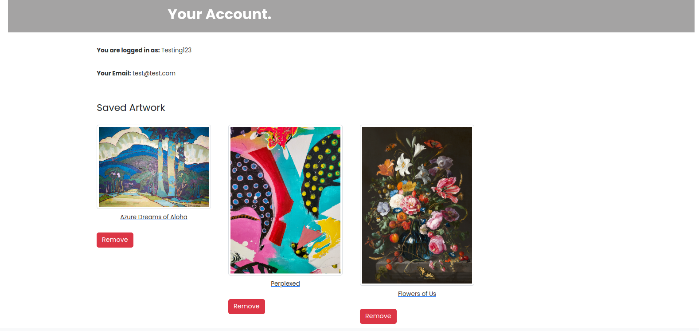


### Save to Collection

The "Save to Collection" feature enhances the user experience by allowing users to curate their own collection of favorite artworks. Here's how it works:

- **Save to Collection Button:** On the Artwork Detail page, a button labeled "Save to Collection" is prominently displayed.
- **Initial State:** Initially, the button is labeled "Save to Collection" before the user interacts with it.
- **First Click:** When the user clicks the "Save to Collection" button, the button state changes to "Saved to Collection," indicating that the artwork has been added to the user's collection. Simultaneously, the selected artwork is saved to the user's collection in their Account page.
- **Second Click:** If the user clicks the button again (now labeled "Saved to Collection"), the button state reverts to "Save to Collection." Additionally, the selected artwork is removed from the user's collection in their Account page.


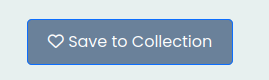 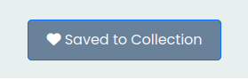


### Commenting

The Commenting feature is designed to foster user engagement and interaction with artworks. Here's an overview of how the feature operates:

- **Visibility for Logged-In Users:** Comments are visible to users who are logged in. Visitors without an account can view existing comments but are unable to post or see the comment form.
- **Comment Form**: Logged-in users can see and interact with the comment form beneath the artwork details to share their thoughts.
- **Verification Message:** After a user submits a comment, a friendly message appears below the comment form, notifying them that their comment needs verification.
- **Admin Verification:** Comments are not immediately visible to all users. Admin verification is required to ensure the comments meet community guidelines.
- **User Introduction:** Once verified, comments are introduced by the user's name, followed by "user said:" for a personalized touch.

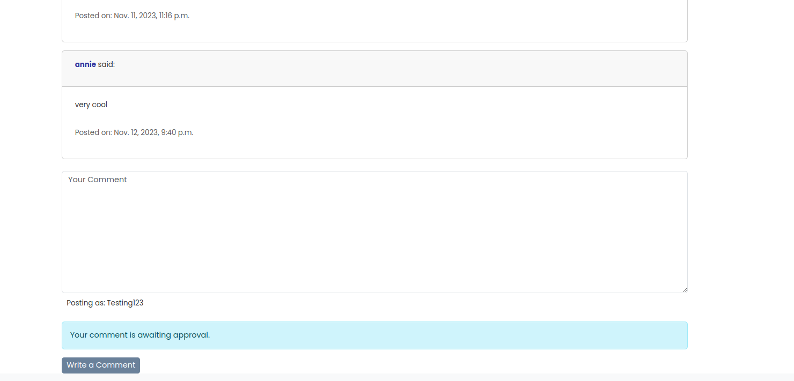

- **Comment Deletion:** Users have the ability to delete their own comments. A delete option is available next to each comment they posted.
- **No Deletion for Others:** Users are unable to delete comments made by other users. This ensures the integrity of the comment section.

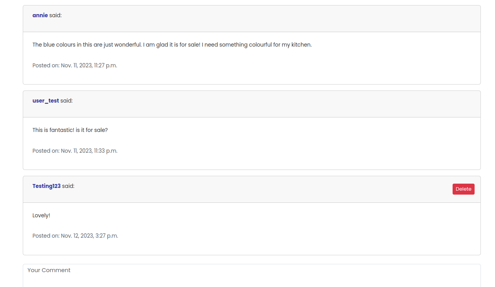

- **Simplicity:** The design of the comment section is intentionally kept simple for ease of use and a clean aesthetic.
- **Eye-Catching Elements:** While maintaining simplicity, the design incorporates eye-catching elements to draw attention to the comments without overwhelming the user.


### Footer

The Footer is a concise yet essential element of the website, providing copyright information.

- **Copyright Symbol:** The footer prominently displays the copyright symbol (©) followed by the text "brushstrokesbyannie."

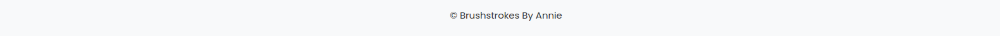


## Features Left to Implement
### Location Map
Contact Section Enhancement

- **Map Integration:** Implement a dynamic map showcasing the physical location of the gallery within the Contact section.
- **Interactive Elements:** Allow users to interact with the map, zoom in/out, and explore the surroundings.
- **Address Information:** Include relevant address information on the map, providing users with a comprehensive understanding of the gallery's location.

### Artwork Purchase Functionality
E-Commerce Integration

- **Shopping Cart System:** Implement a shopping cart system allowing users to add artworks to their cart for purchase.
- **Artwork Details:** Include detailed information on each artwork's page, such as price.
- **Secure Checkout:** Develop a secure checkout process, ensuring the safety of users' payment information.
- **Payment Options:** Provide multiple payment options for users, including credit/debit cards and other popular payment methods.
- **Order Confirmation:** Send users an order confirmation email after a successful purchase, summarizing their selected artworks and transaction details.


## Testing
### Manual Testing

I've thoroughly tested the application manually to ensure its functionality and provide a seamless user experience. Here are some of the scenarios I've covered:

#### Authentication

1. **User Login and Logout**
   - Navigated to the login page.
   - Entered valid credentials and clicked the login button.
   - Verified successful redirection to the user dashboard.
   - Logged out and confirmed a successful logout.

2. **Password Recovery**
   - Initiated the password recovery process.
   - Received the password recovery email.
   - Followed the link and confirmed the ability to reset the password.

#### Artwork Interaction

3. **Viewing Artwork Details**
   - Visited the gallery page.
   - Clicked on multiple artworks to view their details.
   - Verified that each artwork details page displays the correct information.
   - Ensured smooth navigation back to the gallery.

4. **Saving and Removing Artwork**
   - Logged in and navigated to the gallery.
   - Saved a few artworks to my collection.
   - Checked that the saved artworks appear in my account page.
   - Removed an artwork from my collection and confirmed the update.

#### Contact Form

5. **Submitting Contact Form**
   - Filled out the contact form with valid data.
   - Submitted the form and checked for successful submission.
   - Verified that the submitted form details are recorded.
  
#### Comments Interaction

6. **Viewing Comments**
   - Navigated to various artworks with comments.
   - Verified that comments are displayed beneath each artwork.
   - Checked for correct rendering of the user's name, comment body, and timestamp.

7. **Submitting Comments**
   - Logged in and visited an artwork with no comments.
   - Submitted a new comment.
   - Checked that the new comment appears immediately below the artwork.

8. **Comment Verification**
   - Submitted a comment with a different user account.
   - Checked that new comments go through an approval process.
   - Verified that unapproved comments are not visible to other users.

9. **Deleting Own Comments**
   - Logged in and visited an artwork with personal comments.
   - Deleted one's own comment.
   - Verified that the comment is immediately removed from the display.

10. **Comment Interaction for Visitors**
   - Logged out and attempted to submit a comment.
   - Verified that the comment form is not accessible for visitors.
   - Checked that visitors can still view existing comments.
  
## Automated Testing 
   


### Validator Testing

#### Javascript 

#### CSS
- No Errors were found when passing though the official [W3C validator](https://jigsaw.w3.org/css-validator/)

#### Accessibility 
 - I confirmed that the colours and fonts chosen are easy to read and accessible by running them through Lighthouse in Devtools.


## Models
### Artwork Model

**Purpose:** Represents an artwork in the gallery.

**Fields:**
- `title` (CharField): The title of the artwork.
- `artist` (CharField): The name of the artist.
- `created_on` (DateTimeField): The date and time the artwork post was created.
- `description` (TextField): A detailed description of the artwork.
- `medium` (TextField): The type of medium/paint used to create the artwork.
- `image`(CloudinaryField): A image of the artwork
- `size`(CharField): size of the artwork.
- `year_created`(PositiveIntegerField): Year which the artwork was created.
- `sold`(status_choices): Sold or For Sale
- `slug`(SlugField): Artwork Slug
- `saved by`(ManytoManyField): Which users have saved the artwork.
- `status`(status_choices): Draft or Published. 

**Relationships:**
- `saved_by` (ManyToManyField to User): Users who have saved this artwork.

**Validations:**
- The `year_created` field should not exceed the current year.
- If selected 'Draft' the artwork will not publish. If selected 'Published' the artwork will be published and seen on the site.

**Model Instances:**
### Example of creating an Artwork instance

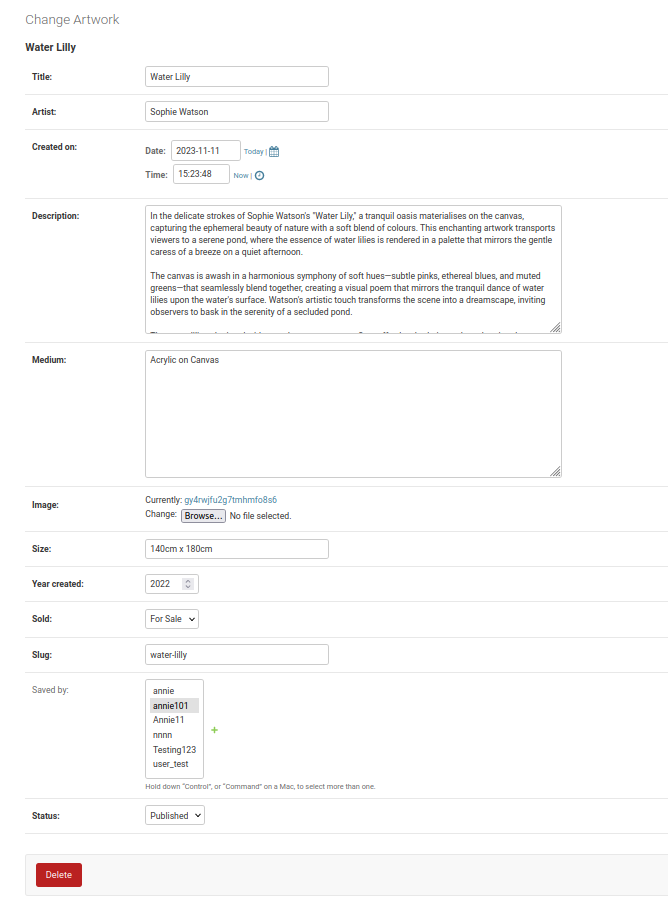


### Comment Model

**Purpose:** Represents a comment on an artwork in the gallery.

**Fields:**
- `artwork` (ForeignKey to Artwork): The artwork to which the comment is associated.
- `user` (ForeignKey to User): The user who posted the comment.
- `body` (DateTimeField): (TextField): The content of the comment.
- `created_on` (DateTimeField): The date and time the comment was posted.
- `approved` (BooleanField): Indicates whether the comment has been approved.

**Relationships:**
- `artwork` (ForeignKey to Artwork): Relates each comment to a specific artwork.
- `user` (ForeignKey to User): Relates each comment to a specific user.

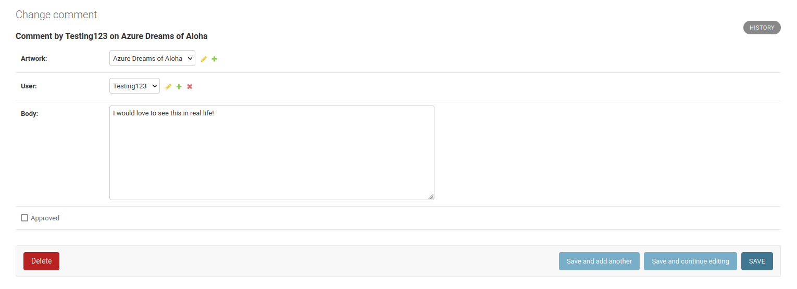


### Contact Form Submission Model
**Purpose:** Represents a submission made through the contact form. 

**Fields:**
- `name` (CharField): The name of the person making the submission.
- `email` (EmailField): The email address of the person making the submission.
- `message` (TextField): The message submitted through the contact form.
- `created_at` (DateTimeField): The date and time the submission was made.

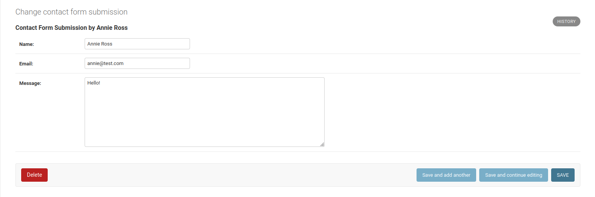

## UX Design

### Wireframes

The following wireframes illustrate the initial design concepts for key pages in the Brushstrokes Online Gallery. These wireframes serve as a foundation for the design and layout of the Brushstrokes Online Gallery, providing a visual guide for the development and ensuring a consistent user experience.


### Flow Diagram

The user experience (UX) design of the Brushstrokes Online Gallery is carefully crafted to guide users seamlessly through various interactions and functionalities. The following user flow outlines key pathways users may take while navigating the platform.


## Fixed Bugs

This section outlines the bugs that were identified and resolved during the development of the project. Each bug is described along with the steps taken to fix it.

### Bug 1: Unwanted Messages Displayed on Contact Page

- **Symptoms:** After logging in or out and navigating to the contact page, unexpected login or logout-related messages were displayed, interfering with the intended success message.
- **Cause:** The global nature of Django's messaging framework was causing messages from the login and logout processes to appear on the contact page.
- **Resolution:**
  - Added the `extra_tags='contact-form'` parameter to the `messages.success` call in the view handling the contact form submission.
  - This additional tag ensures that the success message is specifically associated with the 'contact-form' namespace, preventing interference from other messages.
- **Testing:** Verified that, after the fix, only messages with the 'contact-form' tag are displayed upon navigating to the contact page after login or logout.

### Bug 2: Invalid Future Year Selection in Artwork Model

- **Symptons** Initially, an issue was identified in the Artwork model where administrators were able to select a future year in the `year_created` field, leading to inaccurate data and potentially causing confusion.
- **Cause:** The bug was rooted in the lack of validation for the `year_created` field, allowing admins to input any year without restriction.
- **Resolution:**
   - Implemented custom validation in the save method of the Artwork model.
   - The save method now checks if the `year_created` exceeds the current year, and if so, raises a ValidationError preventing the save operation.
    Code Fix:
```
def save(self, *args, **kwargs):
    current_year = timezone.now().year
    if self.year_created > current_year:
        raise ValidationError("Year created cannot exceed the current year.")
    super(Artwork, self).save(*args, **kwargs)
```
- **Testing:** After the implementation, attempting to save an artwork with a future year results in a clear validation error message, ensuring data accuracy.

### Bug 3: Slug and Pathway Confusion in Artwork Detail Page

- **Symptons**
   - Inconsistencies in the display of the comments section on the Artwork Detail page came from errors arising due to the use of both integer and slug pathways in the URLs.
- **Cause:**
   - The Artwork Detail page initially employed a combination of integer and slug-based URLs, leading to confusion in the interpretation of pathways.
   - The comments section was specifically tied to the integer-based pathway, causing it to be inaccessible when using slug-based URLs.
- **Resolution:**
   - URL Modification: Updated the URLs for the Artwork Detail page to use slugs exclusively and removed integer-based pathways to eliminate conflicts and ensure consistency.
   - Link Updates: Revised all links pointing to the Artwork Detail page to reflect the new slug-based URLs.
- **Testing:**
   - Conducted extensive testing to ensure the comments section appeared consistently on the Artwork Detail page.
   - Verified proper navigation and resolved any errors related to the slug and pathway modifications.
   
### Bug 4: Inaccurate Artwork Search Results
- **Symptons**
   - The initial implementation of the search functionality on the Artwork page was searching for the artwork title, medium, and description.
   - Despite attempts to modify the JavaScript for more focused searches on the artist, the search continued to include the entire artwork description.
   - This led to excessive and less user-friendly search results due to the lengthy nature of artwork descriptions.
- **Cause:**
   - The discrepancy was identified in the `views.py` file, where the search query was still configured to include the artwork description.
- **Resolution:**
   - Modified the search_view function in `views.py` to prioritize searching for the artist (`artist__icontains`) instead of the description (`description__icontains`).
```
def search_view(request):
    query = request.GET.get('q', '')
    artworks = Artwork.objects.all()

    if query:
        artworks = artworks.filter(
            Q(title__icontains=query) |
            Q(medium__icontains=query) |
            Q(artist__icontains=query)
        )

    context = {
        'artworks': artworks,
        'search_query': query,
    }
    return render(request, 'gallery.html', context)
```
- **Testing:**
   - Conducted search tests to verify that the search functionality now focuses on the artwork title, medium, and artist, omitting the description.
   - Ensured that search results align with the desired user-friendly experience.


## Unfixed Bugs
No unfixed bugs


## Deployment
This project was deployed on Heroku.
- Deployment steps:
    - Create a new Heroku app
    - Update the config Vars for deployment
    - Set up Cloudinary Storage
    - Set up Elephant SQL database
    - Set Debug = False
    - Update Requirements
    - Deploy


## Credits
### Content
- The icons in the footer and links were taken from [Font Awesome](https://fontawesome.com/)
- The font for the website was taken from [Google Fonts](https://fonts.google.com/)


 ### Media
